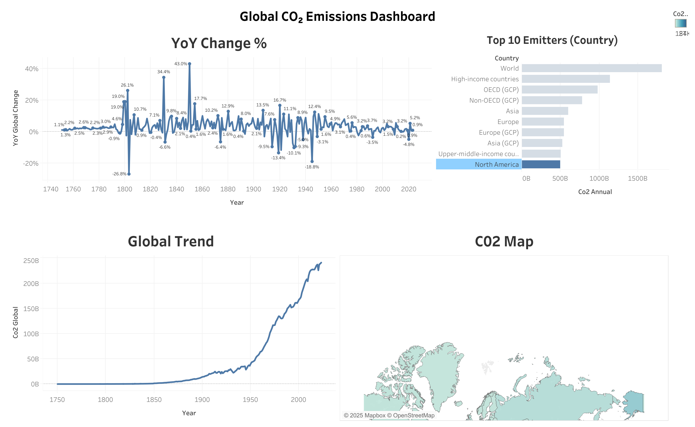

# 🌍 Global CO₂ Emissions Dashboard (Python + Tableau)

This project analyzes global and country-level CO₂ emissions using data from *Our World in Data*.  
The dashboard provides a clear view of global emission trends, year-over-year changes, and top emitters.

🔗 **Live Dashboard (Tableau Public):**  
[Global CO₂ Emissions Dashboard](https://public.tableau.com/app/profile/svara.masurekar/viz/GlobalCO2Emmissions_17633685484670/Dashboard1?publish=yes)

---
## 🛠 Tools Used

- **Python (pandas)** – data cleaning  
- **Tableau Public** – visualisation & dashboard building  
- **GitHub** – portfolio + version control  

---

## 📊 Data Source

The dataset comes from **Our World in Data – CO₂ and Greenhouse Gas Emissions**.  
The original file was cleaned and transformed into:

- `co2_global_clean.csv`  
- `co2_country_clean.csv`  

These files feed into Tableau for visualisation.

---

## 📈 Dashboard Overview

This dashboard includes:

### **1️⃣ YoY Change %**
Shows how global CO₂ emissions fluctuate year-to-year.

### **2️⃣ Global Trend**
A long-term view of rising CO₂ levels since the 18th century.

### **3️⃣ Top 10 Emitters (by region/group)**
A bar chart highlighting major contributors.

### **4️⃣ World CO₂ Map**
A geographic overview of current CO₂ emission intensities.

---

## 🖼 Dashboard Screenshot

---

## 🔍 Key Insights

- CO₂ emissions have risen dramatically since the mid-20th century.  
- Global YoY change shows periods of rapid increase and brief declines (e.g., around major economic events).  
- High-income and industrial regions dominate global emissions.  
- The map highlights significant regional differences across the world.

---
